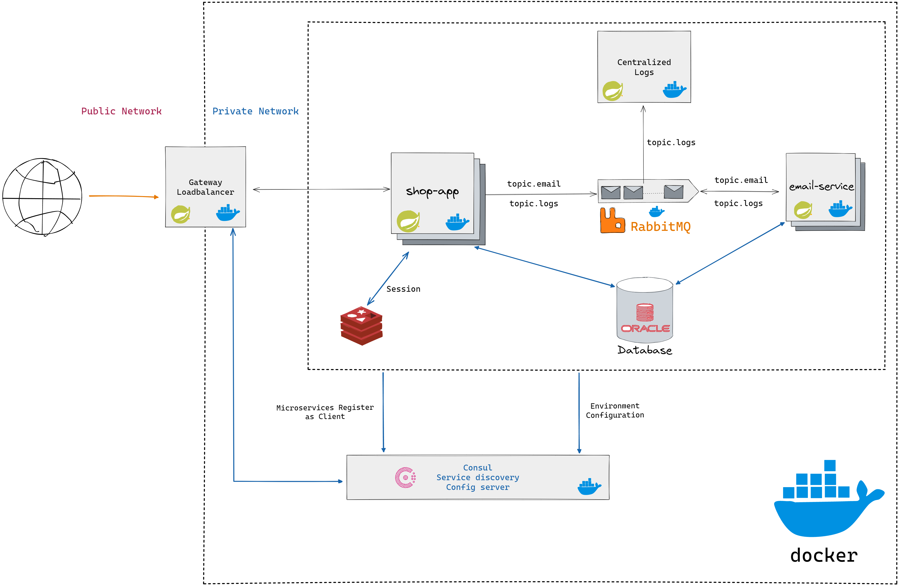
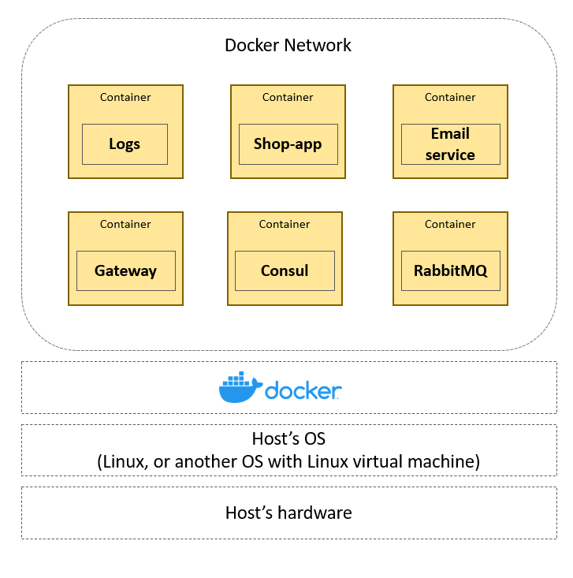
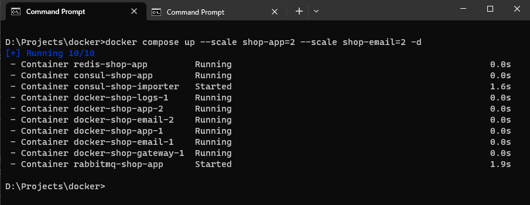
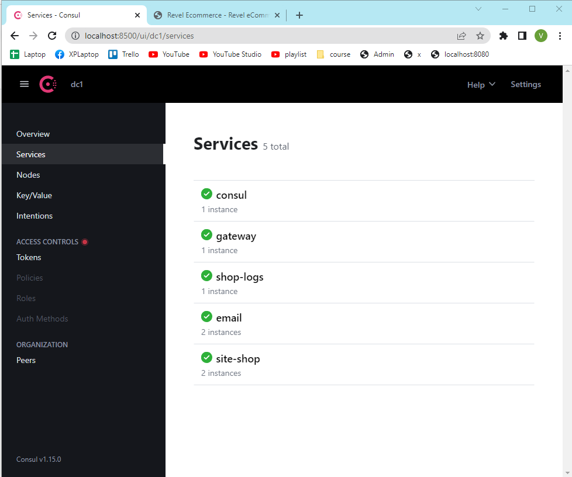
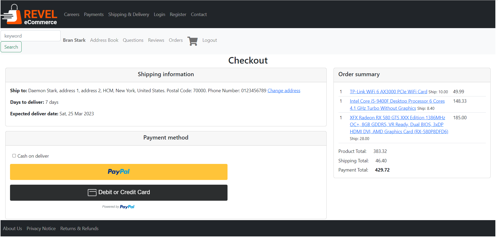

# e-commerce Webapp (Customer site)
## Architecture Overview:



- gateway-service: a module that use Spring Cloud Gateway for running. This module acts as a proxy/gateway and loadbalancer in our architecture.
- consul: a tool that provides Service Discover and Distributed Configuration (using the Consul Key/Value store)
- shop-service: main app, all logic appear here
- email-service: use for sending email
- rabbitmq: messge broker between shop-service and email-service, 
- redis: in-memory database to store session (to solve session sharing problem when adding more instance of shop-service)
- OracleDB: relational database
- logs: centralize logs from all services

### Containerization:
- Use Docker to build Docker image.



- This architecture design allows you easily scale up your system by adding more instances. Example: 
```
docker compose up --sacle shop-app=3 --scale shop-email=3
```
Running this docker compose command will create 3 instances of shop-service and 3 instances of email service.

## Feature
- Customer registration, verify customer email
- Sigin using Google, Facebook, or email
- Change customer information
- Adding more addresses
- Product catalog,  search for the product according to the specified criteria
- Shopping cart: add or delete product (for logged customer only)
- Order (support credit card)

## Result
Docker compose



Consul Service Discovery



Create an Order

